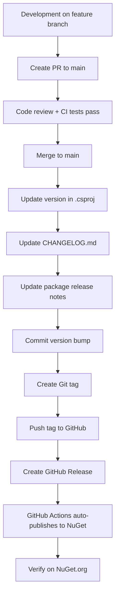

# Release and Package Publishing Best Practices

This document outlines the recommended workflow for managing releases and publishing NuGet packages for HeroSD-JWT.

## Table of Contents

1. [Versioning Strategy](#versioning-strategy)
2. [Release Workflow](#release-workflow)
3. [Pre-Release Checklist](#pre-release-checklist)
4. [Release Types](#release-types)
5. [Changelog Management](#changelog-management)
6. [Git Tagging Strategy](#git-tagging-strategy)
7. [Automation Tips](#automation-tips)
8. [Rollback Procedures](#rollback-procedures)

---

## Versioning Strategy

### Semantic Versioning (SemVer)

Follow [Semantic Versioning 2.0.0](https://semver.org/):

**Format**: `MAJOR.MINOR.PATCH[-PRERELEASE][+BUILD]`

- **MAJOR** (1.x.x): Breaking changes, incompatible API changes
- **MINOR** (x.1.x): New features, backwards-compatible
- **PATCH** (x.x.1): Bug fixes, backwards-compatible
- **PRERELEASE** (x.x.x-alpha.1): Pre-release versions
- **BUILD** (x.x.x+build.123): Build metadata (not used for NuGet)

### Examples

```
1.0.0          → Initial stable release
1.0.1          → Bug fix (backwards compatible)
1.1.0          → New feature (backwards compatible)
2.0.0          → Breaking change
2.0.0-alpha.1  → Pre-release alpha
2.0.0-beta.1   → Pre-release beta
2.0.0-rc.1     → Release candidate
```

### Version Bumping Rules

| Change Type | Version Bump | Example |
|-------------|--------------|---------|
| Bug fix (no API changes) | PATCH | 1.0.0 → 1.0.1 |
| New feature (backwards compatible) | MINOR | 1.0.1 → 1.1.0 |
| Breaking change or major rewrite | MAJOR | 1.1.0 → 2.0.0 |
| Pre-release for next version | PRERELEASE | 2.0.0-alpha.1 |

### When to Increment

- **MAJOR**:
  - Remove public APIs
  - Change method signatures
  - Change behavior that breaks existing consumers
  - Major architectural changes

- **MINOR**:
  - Add new public APIs
  - Add optional parameters with defaults
  - Add new features without breaking existing code
  - Deprecate APIs (but don't remove them)

- **PATCH**:
  - Fix bugs
  - Performance improvements
  - Documentation updates
  - Internal refactoring (no API changes)

---

## Release Workflow

### Standard Release Process



### Step-by-Step Guide

#### 1. Prepare for Release

```bash
# Ensure you're on main and up to date
git checkout main
git pull origin main

# Ensure all tests pass locally
dotnet test --configuration Release

# Build to verify no errors
dotnet build --configuration Release
```

#### 2. Update Version Number

Edit `src/HeroSdJwt.csproj`:

```xml
<PropertyGroup>
  <Version>1.1.0</Version>
  <PackageReleaseNotes>
    Version 1.1.0:
    - Added support for custom hash algorithms
    - Performance improvements for large claim sets
    - Bug fix: Fixed issue with nested array disclosure
  </PackageReleaseNotes>
</PropertyGroup>
```

#### 3. Update CHANGELOG.md

Add entry at the top:

```markdown
## [1.1.0] - 2025-10-22

### Added
- Support for custom hash algorithms in disclosure generation
- Batch disclosure verification API for improved performance

### Changed
- Optimized claim path parsing for 40% faster performance

### Fixed
- Fixed issue with nested array element disclosure (#123)
- Corrected digest validation for SHA-384 algorithm

### Security
- Updated minimum RSA key size validation to 2048 bits
```

#### 4. Commit Version Bump

```bash
git add src/HeroSdJwt.csproj CHANGELOG.md
git commit -m "chore: bump version to 1.1.0

- Update version to 1.1.0 in project file
- Add changelog entries for new features and fixes
- Update package release notes

Ref: #123, #124, #125"

git push origin main
```

#### 5. Create and Push Git Tag

```bash
# Create annotated tag (preferred for releases)
git tag -a v1.1.0 -m "Release v1.1.0

New Features:
- Custom hash algorithm support
- Batch verification API

Bug Fixes:
- Nested array disclosure issue
- SHA-384 digest validation

Full changelog: https://github.com/KoalaFacts/HeroSD-JWT/blob/main/CHANGELOG.md#110---2025-10-22"

# Push tag to GitHub
git push origin v1.1.0
```

#### 6. Create GitHub Release

**Option A: Via GitHub UI** (Recommended)

1. Go to https://github.com/KoalaFacts/HeroSD-JWT/releases
2. Click **Draft a new release**
3. Choose tag: `v1.1.0`
4. Release title: `v1.1.0 - Custom Hash Algorithms`
5. Description (from CHANGELOG.md):
   ```markdown
   ## What's New in 1.1.0

   ### ✨ New Features
   - **Custom Hash Algorithm Support**: You can now specify custom hash algorithms for disclosure generation
   - **Batch Verification API**: New `VerifyBatch()` method for improved performance with multiple presentations

   ### 🐛 Bug Fixes
   - Fixed issue with nested array element disclosure (#123)
   - Corrected SHA-384 digest validation

   ### ⚡ Performance
   - 40% faster claim path parsing
   - Optimized batch operations

   ### 🔒 Security
   - Enforced minimum RSA key size of 2048 bits

   **Full Changelog**: https://github.com/KoalaFacts/HeroSD-JWT/blob/main/CHANGELOG.md#110---2025-10-22

   ---

   ### Installation

   ```bash
   dotnet add package HeroSD-JWT --version 1.1.0
   ```

   ### Upgrade Notes

   This is a backwards-compatible release. No breaking changes.
   ```

6. **Set as latest release**: ✅ Checked
7. Click **Publish release**

**Option B: Via GitHub CLI** (Faster)

```bash
gh release create v1.1.0 \
  --title "v1.1.0 - Custom Hash Algorithms" \
  --notes-file .github/release-notes/v1.1.0.md \
  --latest
```

#### 7. Monitor GitHub Actions

1. Go to **Actions** tab
2. Watch "Publish to NuGet" workflow
3. If production environment has reviewers, **approve the deployment**
4. Wait for workflow to complete

#### 8. Verify Publication

```bash
# Check NuGet.org (may take 5-10 minutes to index)
# https://www.nuget.org/packages/HeroSD-JWT/1.1.0

# Try installing the new version
dotnet new console -n TestInstall
cd TestInstall
dotnet add package HeroSD-JWT --version 1.1.0
dotnet restore
```

---

## Pre-Release Checklist

Before creating any release, verify:

### Code Quality
- [ ] All CI/CD tests passing on `main` branch
- [ ] No compiler warnings in Release build
- [ ] Code coverage meets minimum threshold (if applicable)
- [ ] All TODOs and FIXMEs addressed or documented

### Documentation
- [ ] README.md updated (if API changes)
- [ ] CHANGELOG.md updated with all changes
- [ ] XML documentation comments updated
- [ ] Migration guide written (for breaking changes)
- [ ] Examples updated (if API changes)

### Testing
- [ ] Unit tests passing (277+ tests)
- [ ] Integration tests passing
- [ ] Security tests passing
- [ ] Manual testing completed for new features
- [ ] Backwards compatibility verified (if applicable)

### Version Management
- [ ] Version number updated in `src/HeroSdJwt.csproj`
- [ ] Package release notes updated in `.csproj`
- [ ] Git tag created with proper naming (v1.x.x)
- [ ] Tag message includes summary of changes

### NuGet Package
- [ ] Package metadata correct (author, description, tags)
- [ ] Icon.png included
- [ ] README.md included in package
- [ ] License file included
- [ ] Symbol package (.snupkg) will be generated

### Security
- [ ] No secrets in code or configuration
- [ ] Dependencies scanned for vulnerabilities
- [ ] Security-sensitive changes reviewed
- [ ] Trusted Publishing policy configured on NuGet.org

### Communication
- [ ] Release notes drafted
- [ ] Breaking changes clearly documented
- [ ] Upgrade instructions provided (if needed)
- [ ] Community notified (if applicable)

---

## Release Types

### 1. Stable Release (Production)

**When**: Feature-complete, well-tested, production-ready

```bash
# Version: 1.0.0, 1.1.0, 2.0.0
git tag -a v1.0.0 -m "Release v1.0.0"
```

**GitHub Release Settings**:
- ✅ Set as latest release
- ❌ Pre-release checkbox unchecked

**NuGet**: Published to main feed, shows as stable

---

### 2. Pre-Release (Alpha, Beta, RC)

**When**: Testing new features, gathering feedback

#### Alpha (Early Testing)

```bash
# Version: 2.0.0-alpha.1
# For: Internal testing, breaking changes expected
git tag -a v2.0.0-alpha.1 -m "Alpha release for v2.0.0"
```

#### Beta (Feature Complete)

```bash
# Version: 2.0.0-beta.1
# For: External testing, feature-complete, API stable
git tag -a v2.0.0-beta.1 -m "Beta release for v2.0.0"
```

#### Release Candidate (Nearly Done)

```bash
# Version: 2.0.0-rc.1
# For: Final testing before stable release
git tag -a v2.0.0-rc.1 -m "Release candidate for v2.0.0"
```

**GitHub Release Settings**:
- ❌ Set as latest release unchecked
- ✅ Pre-release checkbox CHECKED

**NuGet**: Shows as pre-release, not installed by default

**Installing Pre-releases**:
```bash
dotnet add package HeroSD-JWT --version 2.0.0-beta.1
# Or
dotnet add package HeroSD-JWT --prerelease
```

---

### 3. Hotfix Release

**When**: Critical bug in production needs immediate fix

```bash
# On main branch at v1.0.0
git checkout -b hotfix/1.0.1

# Make fix
# Update version to 1.0.1
# Update CHANGELOG

git commit -m "fix: critical security issue in digest validation"
git checkout main
git merge hotfix/1.0.1
git tag -a v1.0.1 -m "Hotfix v1.0.1: Security fix for digest validation"
git push origin main v1.0.1

# Backport to other branches if needed
```

---

## Changelog Management

### CHANGELOG.md Format

Follow [Keep a Changelog](https://keepachangelog.com/) format:

```markdown
# Changelog

All notable changes to this project will be documented in this file.

The format is based on [Keep a Changelog](https://keepachangelog.com/en/1.0.0/),
and this project adheres to [Semantic Versioning](https://semver.org/spec/v2.0.0.html).

## [Unreleased]

### Added
- Feature in development but not released yet

### Changed
- Changes in existing functionality

### Deprecated
- Soon-to-be removed features

### Removed
- Removed features

### Fixed
- Bug fixes

### Security
- Vulnerabilities fixes

## [1.1.0] - 2025-10-22

### Added
- Custom hash algorithm support
- Batch verification API

### Fixed
- Nested array disclosure issue (#123)

## [1.0.0] - 2025-10-21

### Added
- Initial stable release
- Full SD-JWT support
- Array element disclosure
- Key binding support

[Unreleased]: https://github.com/KoalaFacts/HeroSD-JWT/compare/v1.1.0...HEAD
[1.1.0]: https://github.com/KoalaFacts/HeroSD-JWT/compare/v1.0.0...v1.1.0
[1.0.0]: https://github.com/KoalaFacts/HeroSD-JWT/releases/tag/v1.0.0
```

### Categories

Use these categories (in order):

1. **Added** - New features
2. **Changed** - Changes in existing functionality
3. **Deprecated** - Soon-to-be removed features
4. **Removed** - Removed features
5. **Fixed** - Bug fixes
6. **Security** - Vulnerability fixes

### Writing Good Changelog Entries

**Good Examples**:
```markdown
- Added `VerifyBatch()` method for batch verification with 10x performance improvement (#145)
- Fixed digest validation failing for SHA-384 algorithm on Windows (#123)
- **BREAKING**: Removed deprecated `CreateSdJwt()` overload that accepted string keys
```

**Bad Examples**:
```markdown
- Fixed bug (❌ not specific enough)
- Updated code (❌ no context)
- Various improvements (❌ too vague)
```

---

## Git Tagging Strategy

### Tag Naming Convention

**Stable Releases**:
```bash
v1.0.0      # Stable release
v1.1.0      # Minor update
v2.0.0      # Major update
```

**Pre-releases**:
```bash
v2.0.0-alpha.1    # Alpha 1
v2.0.0-alpha.2    # Alpha 2
v2.0.0-beta.1     # Beta 1
v2.0.0-rc.1       # Release candidate 1
```

### Annotated vs Lightweight Tags

**Always use annotated tags for releases**:

```bash
# ✅ Good - Annotated tag (recommended)
git tag -a v1.0.0 -m "Release v1.0.0: Initial stable release"

# ❌ Bad - Lightweight tag (for temporary markers only)
git tag v1.0.0
```

**Why annotated tags?**
- Include author, date, and message
- Can be signed with GPG
- Show in GitHub release dropdown
- Better for auditing

### Tag Message Template

```bash
git tag -a v1.1.0 -m "Release v1.1.0

New Features:
- Custom hash algorithm support
- Batch verification API

Bug Fixes:
- Fixed nested array disclosure issue
- Corrected SHA-384 digest validation

Performance:
- 40% faster claim path parsing

Security:
- Enforced minimum RSA key size of 2048 bits

Breaking Changes: None

Full changelog: https://github.com/KoalaFacts/HeroSD-JWT/blob/main/CHANGELOG.md#110"
```

### Listing and Managing Tags

```bash
# List all tags
git tag

# List tags matching pattern
git tag -l "v1.*"

# Show tag details
git show v1.0.0

# Delete local tag
git tag -d v1.0.0

# Delete remote tag (careful!)
git push origin :refs/tags/v1.0.0

# Push single tag
git push origin v1.0.0

# Push all tags
git push origin --tags
```

---

## Automation Tips

### 1. Automated Versioning (Optional)

Use tools to automate version bumping:

**GitVersion** (recommended):
```yaml
# GitVersion.yml
mode: ContinuousDeployment
branches:
  main:
    tag: ''
  develop:
    tag: alpha
```

**Semantic Release**:
```json
// package.json
{
  "release": {
    "branches": ["main"],
    "plugins": [
      "@semantic-release/commit-analyzer",
      "@semantic-release/release-notes-generator",
      "@semantic-release/github"
    ]
  }
}
```

### 2. Automated Changelog Generation

**From commits** (requires conventional commits):
```bash
# Install tool
npm install -g conventional-changelog-cli

# Generate changelog
conventional-changelog -p angular -i CHANGELOG.md -s
```

**Conventional Commit Messages**:
```bash
feat: add custom hash algorithm support
fix: correct SHA-384 digest validation
docs: update API documentation for new methods
chore: bump version to 1.1.0
BREAKING CHANGE: remove deprecated CreateSdJwt overload
```

### 3. Release Checklist Action

Create `.github/workflows/release-checklist.yml`:

```yaml
name: Release Checklist

on:
  pull_request:
    branches: [main]

jobs:
  checklist:
    runs-on: ubuntu-latest
    if: contains(github.event.pull_request.title, 'release')
    steps:
      - name: Check CHANGELOG updated
        run: |
          if ! git diff origin/main -- CHANGELOG.md | grep -q '^+'; then
            echo "❌ CHANGELOG.md not updated"
            exit 1
          fi

      - name: Check version bumped
        run: |
          # Add version check logic
          echo "✅ Version check passed"
```

### 4. Draft Release Notes Automatically

Use GitHub's auto-generated release notes as a starting point:

1. Go to Releases → Draft new release
2. Click **Generate release notes** button
3. Edit and enhance with your own formatting

---

## Rollback Procedures

### If Bad Package Published to NuGet

**You cannot delete or replace a published version on NuGet.org!**

#### Option 1: Unlist (Preferred)

```bash
# Via NuGet.org web interface:
# 1. Go to package management page
# 2. Select the version
# 3. Click "Unlist"
```

Unlisted packages:
- Cannot be discovered in search
- Can still be installed if version is explicit
- Existing installations continue to work

#### Option 2: Publish Fixed Version

```bash
# Publish hotfix version immediately
v1.0.1 (fixes issues in v1.0.0)

# Communicate via:
# - GitHub release notes
# - NuGet package description
# - Community channels
```

### If Bad Git Tag Pushed

```bash
# Delete remote tag
git push origin :refs/tags/v1.0.0

# Delete local tag
git tag -d v1.0.0

# Create corrected tag
git tag -a v1.0.0 -m "Release v1.0.0 (corrected)"
git push origin v1.0.0
```

⚠️ **Warning**: Only do this if package wasn't published yet!

### If Bad Release on GitHub

1. Go to release page
2. Click **Edit release**
3. Either:
   - Update description
   - Change to pre-release
   - Delete release (tag remains)

---

## Best Practices Summary

### DO ✅

- ✅ Use semantic versioning consistently
- ✅ Maintain detailed CHANGELOG.md
- ✅ Use annotated Git tags for releases
- ✅ Test thoroughly before releasing
- ✅ Write clear, descriptive release notes
- ✅ Use Trusted Publishing with production environment
- ✅ Require manual approval for production deployments
- ✅ Keep release notes user-focused (not developer-focused)
- ✅ Include upgrade instructions for breaking changes
- ✅ Verify package installation after publishing

### DON'T ❌

- ❌ Skip version bumps
- ❌ Release without updating CHANGELOG
- ❌ Use lightweight tags for releases
- ❌ Publish without testing
- ❌ Release on Friday afternoon (if avoidable)
- ❌ Include secrets or API keys in releases
- ❌ Rush releases under pressure
- ❌ Forget to update package metadata
- ❌ Mix multiple unrelated changes in one release
- ❌ Publish breaking changes in PATCH versions

---

## Quick Reference

### Release Commands

```bash
# Prepare release
git checkout main && git pull
dotnet test --configuration Release
dotnet build --configuration Release

# Update version in src/HeroSdJwt.csproj
# Update CHANGELOG.md

# Commit changes
git add .
git commit -m "chore: bump version to 1.1.0"
git push origin main

# Create and push tag
git tag -a v1.1.0 -m "Release v1.1.0"
git push origin v1.1.0

# Create GitHub release (triggers publish)
gh release create v1.1.0 --title "v1.1.0" --notes-file RELEASE_NOTES.md

# Verify
# https://www.nuget.org/packages/HeroSD-JWT/1.1.0
```

### Version Decision Tree

```
Breaking change? → MAJOR (2.0.0)
    ↓ No
New feature? → MINOR (1.1.0)
    ↓ No
Bug fix? → PATCH (1.0.1)
```

---

## Additional Resources

- **Semantic Versioning**: https://semver.org/
- **Keep a Changelog**: https://keepachangelog.com/
- **Conventional Commits**: https://www.conventionalcommits.org/
- **GitHub Releases**: https://docs.github.com/en/repositories/releasing-projects-on-github
- **NuGet Versioning**: https://learn.microsoft.com/en-us/nuget/concepts/package-versioning
- **Trusted Publishing**: https://learn.microsoft.com/en-us/nuget/nuget-org/publish-a-package#trusted-publishing

---

**Last Updated**: 2025-10-21
**Maintainer**: KoalaFacts Team
